## 数据增强
### 通用

#### Compose


```python
from ModelHelper.Common.CommonUtils.ImageAugmentation import SaltNoise, GaussianBlur, Compose
import cv2

if __name__ == '__main__':
    img_path = 'input2.jpg'
    save_path = 'output.jpg'
    image = cv2.imread(img_path)
    compose = Compose([GaussianBlur(),
                      SaltNoise(0.01)])
    image = compose(image)
    cv2.imwrite(save_path, image)

```

#### RandomDistort 随机扭曲
主要用于OCR文本图像的数据增强。


```python
from ModelHelper.Common.CommonUtils.ImageAugmentation import RandomDistort
import cv2

if __name__ == '__main__':
    img_path = 'input1.jpg'
    save_path = 'random_distort_output.jpg'
    image = cv2.imread(img_path)
    random_distort = RandomDistort(20, 0.1)
    image = random_distort(image)
    cv2.imwrite(save_path, image)

```

首先构建RandomDistort对象，random_distort = RandomDistort(20, 0.1)；其中20表示将图横向分为20块，0.1表示扭曲程度，值越大扭曲越剧烈。输入，输出图像如下所示：

输入：
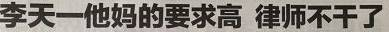

输出:
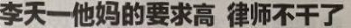

#### AutoLevelsAdjustment 自动调整色阶
主要用于处理图像整体过暗或者过亮的问题。


```python
from ModelHelper.Common.CommonUtils.ImageAugmentation import AutoLevelsAdjustment
import cv2

if __name__ == '__main__':
    img_path = 'input3.jpg'
    save_path = 'ala.jpg'
    image = cv2.imread(img_path)
    ala = AutoLevelsAdjustment()
    ala_img = ala(image)
    cv2.imwrite(save_path, ala_img)
```

构建AutoLevelsAdjustment对象，ala = AutoLevelsAdjustment()。输入，输出图像如下所示：

输入：
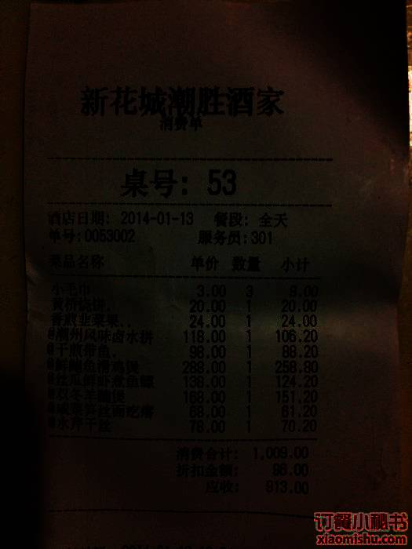

输出:
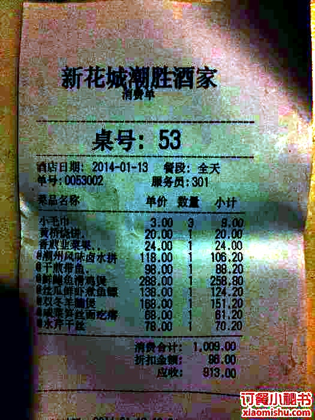

#### 光照补偿
用于解决局部过渡曝光和曝光不足的问题。


```python
from ModelHelper.Common.CommonUtils.ImageAugmentation import LightCompensate
import cv2

if __name__ == '__main__':
    img_path = 'input4.jpg'
    save_path = 'light_compensate.jpg'
    image = cv2.imread(img_path)
    light_compensate = LightCompensate()
    output = light_compensate(image)
    cv2.imwrite(save_path, output)
```

首先构建ImageAugmentation对象，light_compensate = LightCompensate(block_size=10, blur_kernel=(3, 3), blur_sigma=1)；其中block_size
block_size为可调节参数，blur_kernel为高斯，输出图像如下所示：

输入：

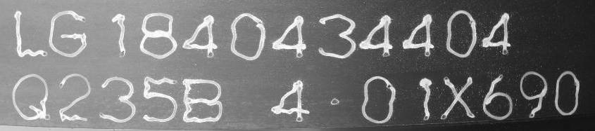

输出:
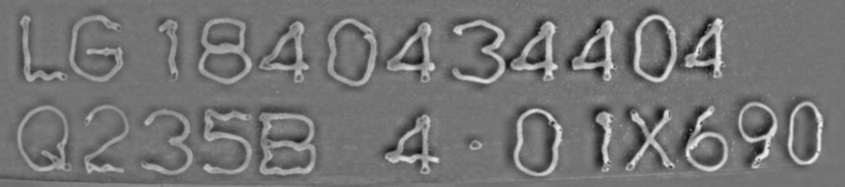

#### GaussianBlur 高斯模糊


```python
from ModelHelper.Common.CommonUtils.ImageAugmentation import GaussianBlur
import cv2

if __name__ == '__main__':
    img_path = 'input.jpg'
    save_path = 'gaussian_blur_output.jpg'
    image = cv2.imread(img_path)
    gaussian_blur = GaussianBlur((5, 5), 0)
    image = gaussian_blur(image)
    cv2.imwrite(save_path, image)

```

首先构建GaussianBlur对象，gaussian_blur = GaussianBlur((5, 5), 0)；其中（5，5）为高斯滤波器的大小，默认为（3，3）；0为模糊程度，默认为0。输入，输出图像如下所示：

输入：

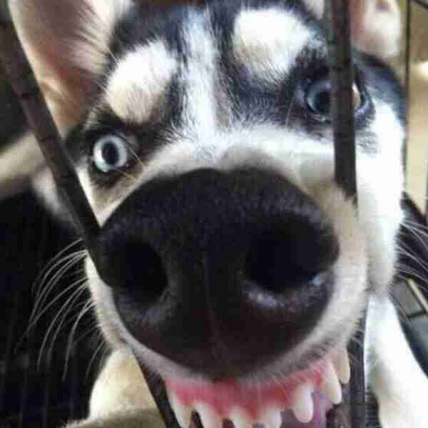

输出:


#### 椒盐噪声


```python
from ModelHelper.Common.CommonUtils.ImageAugmentation import SaltNoise
import cv2

if __name__ == '__main__':
    img_path = 'input.jpg'
    save_path = 'salt_noise_output.jpg'
    image = cv2.imread(img_path)
    salt_noise = SaltNoise(0.2)
    image = salt_noise(image)
    cv2.imwrite(save_path, image)

```

首先构建SaltNoise对象，salt_noise = SaltNoise(0.2)；其中0.2为添加的椒盐噪声数量与图片总像素数量的比例。输入，输出图像如下所示：

输入：


输出:


#### Denoise 去噪
主要用于去除OCR文本图像的椒盐噪声。


```python
from ModelHelper.Common.CommonUtils.ImageAugmentation import Denoise, GaussianBlur, SaltNoise
import cv2

if __name__ == '__main__':
    img_path = 'salt_noise.jpg'
    save_path = 'denoise.jpg'
    image = cv2.imread(img_path)
    denoise = Denoise(blur_kernel=(3,3), blur_sigma=2, enhance_ratio=2)
    dn = denoise(image)
    cv2.imwrite(save_path, dn)

```

首先构建Denoise对象，denoise = Denoise(blur_kernel=(3,3), blur_sigma=2, enhance_ratio=2)；其中blur_kernel为高斯核的大小，blur_sigma为高斯模糊的程度，值越大越模糊，enhance_ratio为图像轮廓信息对比度加强的程度。输入，输出图像如下所示：

输入：
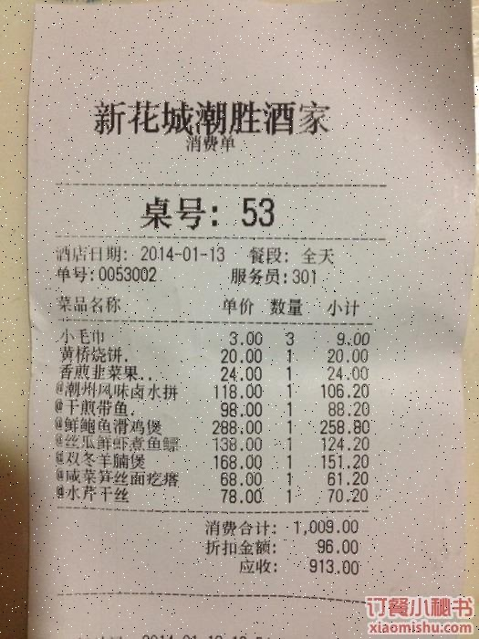

输出:
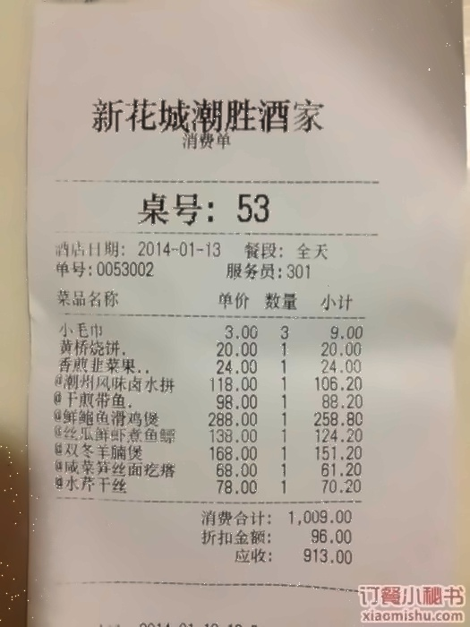

#### Padding 自动填充
将输入的任意尺寸图像往上下或左右自动填充黑边并resize到固定尺寸，保持输入图像不发生形变。


```python
from ModelHelper.Common.CommonUtils.ImageAugmentation import Padding
import cv2

if __name__ == '__main__':
    img_path = 'input.jpg'
    save_path = 'padding_output.jpg'
    image = cv2.imread(img_path)
    padding = Padding((1200, 600))
    image = padding(image)
    cv2.imwrite(save_path, image)

```

首先构建Padding对象，padding = Padding((1200, 600))；其中(1200, 600)为输出图像的尺寸。输入，输出图像如下所示：

输入：


输出:
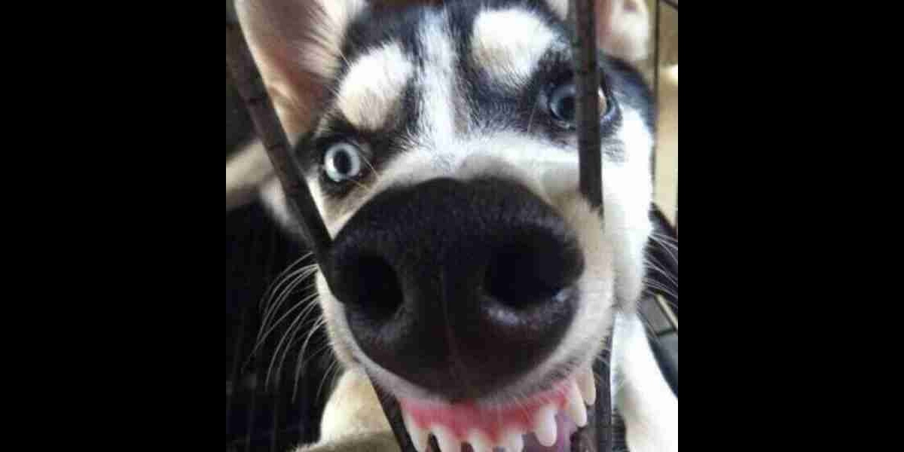
#### RandomPadding 随机填充
将图像的上下左右随机填充一定尺寸的黑边，并resize输出图像到输入图像册尺寸，图像会发生一定程度的形变。


```python
from ModelHelper.Common.CommonUtils.ImageAugmentation import RandomPadding
import cv2

if __name__ == '__main__':
    img_path = 'input.jpg'
    save_path = 'random_padding_output.jpg'
    image = cv2.imread(img_path)
    random_padding = RandomPadding(100, 100, 200, 200)
    image = random_padding(image)
    cv2.imwrite(save_path, image)

```

首先构建RandomPadding对象，random_padding = RandomPadding(100, 100, 200, 200)；其中100,100,200,200为上下左右填充黑边的最大尺寸。输入，输出图像如下所示：

输入：


输出:
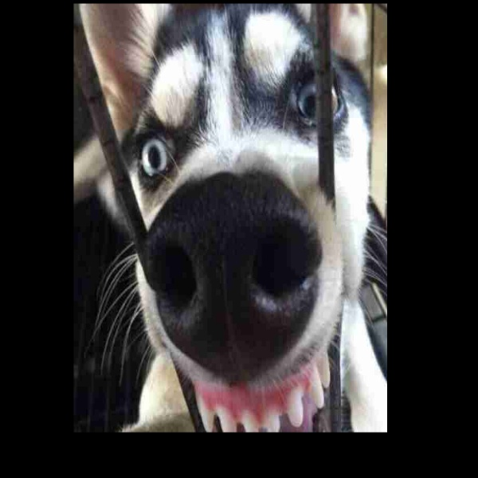
