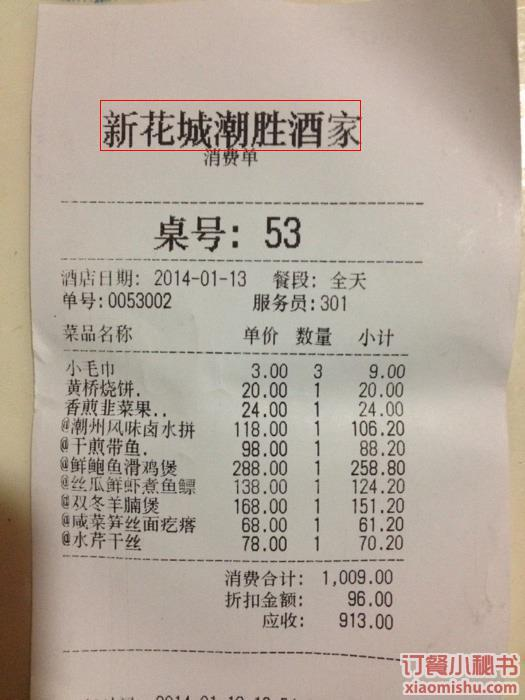
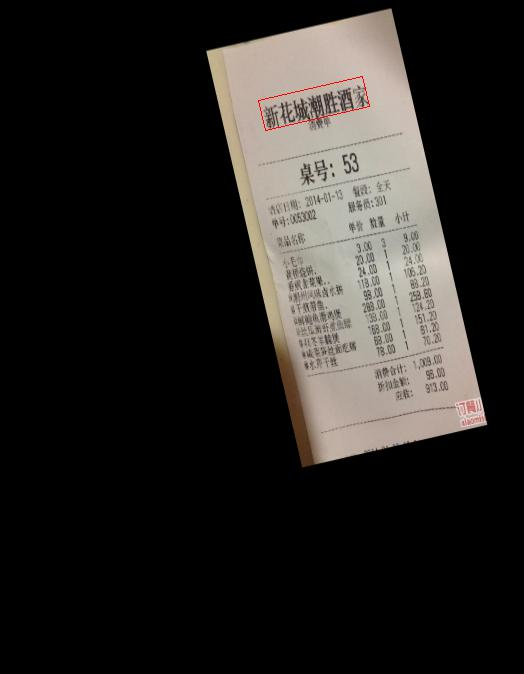
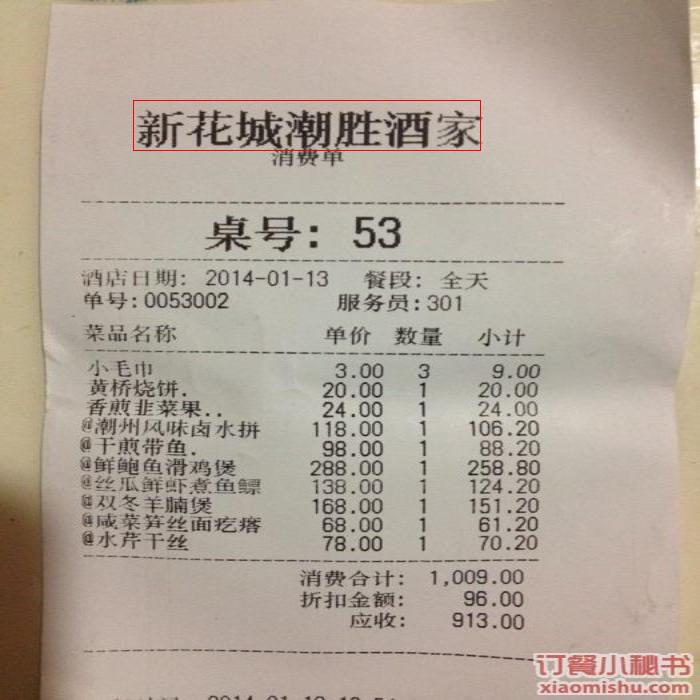
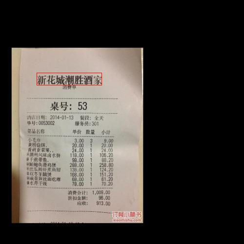
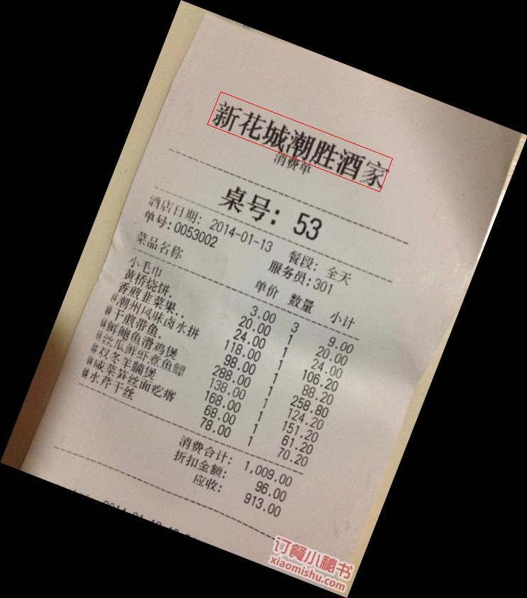
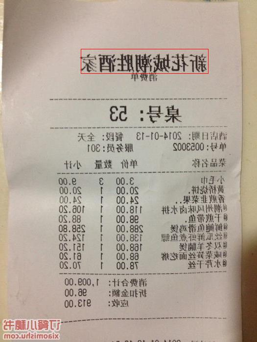
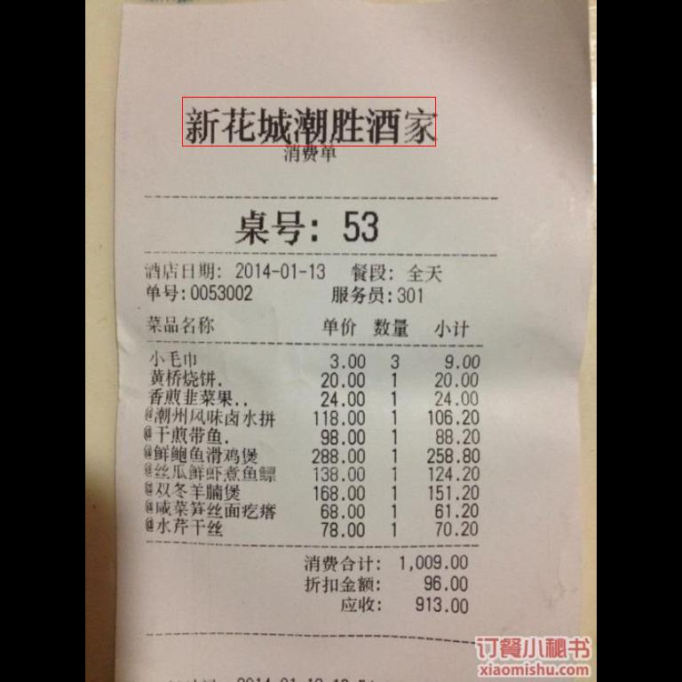

#### DetectionCompose


```python
from ModelHelper.Detection.DetectionUtils.DataAugmentation import DetectionCompose, RandomCrop, CenterRotate
from ModelHelper.Common.CommonUtils.HandleImage import cv2pil
import cv2
import numpy as np
from PIL import ImageDraw


def draw_img(image, qua_array, save_path, color=(255, 0, 0)):
    draw = ImageDraw.Draw(image)
    qua_num = qua_array.shape[0]
    for idx in range(qua_num):
        array = qua_array[idx, :, :]
        poly = (array[0][0], array[0][1], array[1][0], array[1][1],
                array[2][0], array[2][1], array[3][0], array[3][1],)
    draw.polygon(poly, outline=color)
    image.save(save_path)


if __name__ == '__main__':
    img_path = 'input2.jpg'
    qua_array = np.zeros((1, 4, 2), dtype=np.int32)
    qua_array[0][0][0] = 100
    qua_array[0][0][1] = 100
    qua_array[0][1][0] = 360
    qua_array[0][1][1] = 100
    qua_array[0][2][0] = 360
    qua_array[0][2][1] = 150
    qua_array[0][3][0] = 100
    qua_array[0][3][1] = 150
    image = cv2.imread(img_path)
    image_pil = cv2pil(image)
    draw_img(image_pil, qua_array, 'input2_draw.jpg')
    detection_compose = DetectionCompose([RandomCrop((1, 4), (600, 400)),
                                          CenterRotate((-30, 30))])
    image, qua_array = detection_compose(image, qua_array)
    image_pil = cv2pil(image)
    draw_img(image_pil, qua_array, 'detection_compose.jpg')
```




#### Resize


```python
from ModelHelper.Detection.DetectionUtils.DataAugmentation import Resize
from ModelHelper.Common.CommonUtils.HandleImage import cv2pil
import cv2
import numpy as np
from PIL import ImageDraw


def draw_img(image, qua_array, save_path, color=(255, 0, 0)):
    draw = ImageDraw.Draw(image)
    qua_num = qua_array.shape[0]
    for idx in range(qua_num):
        array = qua_array[idx, :, :]
        poly = (array[0][0], array[0][1], array[1][0], array[1][1],
                array[2][0], array[2][1], array[3][0], array[3][1],)
    draw.polygon(poly, outline=color)
    image.save(save_path)


if __name__ == '__main__':
    img_path = 'input2.jpg'
    qua_array = np.zeros((1, 4, 2), dtype=np.int32)
    qua_array[0][0][0] = 100
    qua_array[0][0][1] = 100
    qua_array[0][1][0] = 360
    qua_array[0][1][1] = 100
    qua_array[0][2][0] = 360
    qua_array[0][2][1] = 150
    qua_array[0][3][0] = 100
    qua_array[0][3][1] = 150
    image = cv2.imread(img_path)
    image_pil = cv2pil(image)
    draw_img(image_pil, qua_array, 'input2_draw.jpg')
    resize = Resize((700, 700))
    image, qua_array = resize(image, qua_array)
    image_pil = cv2pil(image)
    draw_img(image_pil, qua_array, 'resize_draw.jpg')
```




#### RandomCrop


```python
from ModelHelper.Detection.DetectionUtils.DataAugmentation import RandomCrop
from ModelHelper.Common.CommonUtils.HandleImage import cv2pil
import cv2
import numpy as np
from PIL import ImageDraw


def draw_img(image, qua_array, save_path, color=(255, 0, 0)):
    draw = ImageDraw.Draw(image)
    qua_num = qua_array.shape[0]
    for idx in range(qua_num):
        array = qua_array[idx, :, :]
        poly = (array[0][0], array[0][1], array[1][0], array[1][1],
                array[2][0], array[2][1], array[3][0], array[3][1],)
    draw.polygon(poly, outline=color)
    image.save(save_path)


if __name__ == '__main__':
    img_path = 'input2.jpg'
    qua_array = np.zeros((1, 4, 2), dtype=np.int32)
    qua_array[0][0][0] = 100
    qua_array[0][0][1] = 100
    qua_array[0][1][0] = 360
    qua_array[0][1][1] = 100
    qua_array[0][2][0] = 360
    qua_array[0][2][1] = 150
    qua_array[0][3][0] = 100
    qua_array[0][3][1] = 150
    image = cv2.imread(img_path)
    image_pil = cv2pil(image)
    draw_img(image_pil, qua_array, 'input2_draw.jpg')
    random_crop = RandomCrop((1, 4), (500, 500))
    image, qua_array = random_crop(image, qua_array)
    image_pil = cv2pil(image)
    draw_img(image_pil, qua_array, 'random_crop.jpg')
```




#### CenterRotate


```python
from ModelHelper.Detection.DetectionUtils.DataAugmentation import CenterRotate
from ModelHelper.Common.CommonUtils.HandleImage import cv2pil
import cv2
import numpy as np
from PIL import ImageDraw


def draw_img(image, qua_array, save_path, color=(255, 0, 0)):
    draw = ImageDraw.Draw(image)
    qua_num = qua_array.shape[0]
    for idx in range(qua_num):
        array = qua_array[idx, :, :]
        poly = (array[0][0], array[0][1], array[1][0], array[1][1],
                array[2][0], array[2][1], array[3][0], array[3][1],)
    draw.polygon(poly, outline=color)
    image.save(save_path)


if __name__ == '__main__':
    img_path = 'input2.jpg'
    qua_array = np.zeros((1, 4, 2), dtype=np.int32)
    qua_array[0][0][0] = 100
    qua_array[0][0][1] = 100
    qua_array[0][1][0] = 360
    qua_array[0][1][1] = 100
    qua_array[0][2][0] = 360
    qua_array[0][2][1] = 150
    qua_array[0][3][0] = 100
    qua_array[0][3][1] = 150
    image = cv2.imread(img_path)
    image_pil = cv2pil(image)
    draw_img(image_pil, qua_array, 'input2_draw.jpg')
    center_rotate = CenterRotate((-30, 30))
    image, qua_array = center_rotate(image, qua_array)
    image_pil = cv2pil(image)
    draw_img(image_pil, qua_array, 'center_rotate.jpg')
```




#### Flip


```python
from ModelHelper.Detection.DetectionUtils.DataAugmentation import Flip
from ModelHelper.Common.CommonUtils.HandleImage import cv2pil
import cv2
import numpy as np
from PIL import ImageDraw


def draw_img(image, qua_array, save_path, color=(255, 0, 0)):
    draw = ImageDraw.Draw(image)
    qua_num = qua_array.shape[0]
    for idx in range(qua_num):
        array = qua_array[idx, :, :]
        poly = (array[0][0], array[0][1], array[1][0], array[1][1],
                array[2][0], array[2][1], array[3][0], array[3][1],)
    draw.polygon(poly, outline=color)
    image.save(save_path)


if __name__ == '__main__':
    img_path = 'input2.jpg'
    qua_array = np.zeros((1, 4, 2), dtype=np.int32)
    qua_array[0][0][0] = 100
    qua_array[0][0][1] = 100
    qua_array[0][1][0] = 360
    qua_array[0][1][1] = 100
    qua_array[0][2][0] = 360
    qua_array[0][2][1] = 150
    qua_array[0][3][0] = 100
    qua_array[0][3][1] = 150
    image = cv2.imread(img_path)
    image_pil = cv2pil(image)
    draw_img(image_pil, qua_array, 'input2_draw.jpg')
    flip = Flip('Horizontal', 1)
    image, qua_array = flip(image, qua_array)
    image_pil = cv2pil(image)
    draw_img(image_pil, qua_array, 'flip.jpg')

```




#### Padding


```python
from ModelHelper.Detection.DetectionUtils.DataAugmentation import Padding
from ModelHelper.Common.CommonUtils.HandleImage import cv2pil
import cv2
import numpy as np
from PIL import ImageDraw


def draw_img(image, qua_array, save_path, color=(255, 0, 0)):
    draw = ImageDraw.Draw(image)
    qua_num = qua_array.shape[0]
    for idx in range(qua_num):
        array = qua_array[idx, :, :]
        poly = (array[0][0], array[0][1], array[1][0], array[1][1],
                array[2][0], array[2][1], array[3][0], array[3][1],)
    draw.polygon(poly, outline=color)
    image.save(save_path)


if __name__ == '__main__':
    img_path = 'input2.jpg'
    qua_array = np.zeros((1, 4, 2), dtype=np.int32)
    qua_array[0][0][0] = 100
    qua_array[0][0][1] = 100
    qua_array[0][1][0] = 360
    qua_array[0][1][1] = 100
    qua_array[0][2][0] = 360
    qua_array[0][2][1] = 150
    qua_array[0][3][0] = 100
    qua_array[0][3][1] = 150
    image = cv2.imread(img_path)
    image_pil = cv2pil(image)
    draw_img(image_pil, qua_array, 'input2_draw.jpg')
    padding = Padding((768, 768))
    image, qua_array = padding(image, qua_array)
    image_pil = cv2pil(image)
    draw_img(image_pil, qua_array, 'padding.jpg')
```



